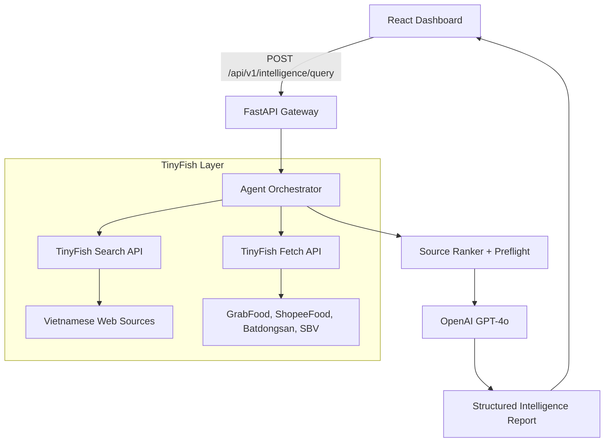

# FinSight

**Live Demo:** [https://finsight.vercel.app](https://finsight.vercel.app)

**Source repo:** [https://github.com/MANASMATHUR/FinSight](https://github.com/MANASMATHUR/FinSight)

FinSight is a Vietnamese market intelligence console for enterprise expansion teams. It turns natural-language questions about leasing, F&B pricing, SME finance, and regulatory changes into structured briefs with honest confidence scoring. **TinyFish Search** discovers live Vietnamese sources; **TinyFish Fetch** extracts token-efficient markdown from JS-heavy sites (GrabFood, ShopeeFood, Batdongsan, SBV circulars); an LLM then synthesizes board-ready or visibly insufficient reports depending on source quality.

---

## Demo


Try a preset query on the live demo, or run locally with your own API keys (see below).

---

## How TinyFish API is Used

FinSight uses the official **TinyFish Python SDK** (`pip install tinyfish`) for Search + Fetch in a multi-stage pipeline: plan search angles → rank sources → concurrent fetch → fact extraction → synthesis. Vietnam editorial domains are prioritized; thin or app-gated pages fail visibly instead of returning placeholder metrics.

### Code Snippet

```python
# api/services/tinyfish_client.py
from tinyfish import AsyncTinyFish

client = AsyncTinyFish()  # reads TINYFISH_API_KEY from env

response = await client.search.query(
    query="commercial rent District 1 HCMC",
    location="VN",
    language="vi",
)
for result in response.results:
    print(result.title, result.url)

pages = await client.fetch.get_contents(
    urls=["https://batdongsan.com.vn/..."],
    format="markdown",
)
print(pages.results[0].text)
```

The orchestrator in `api/services/agent_workflows.py` wires Search → Fetch → LLM with source preflight, recovery search passes, and answer-quality gating (`direct` / `partial` / `not_answered`).

---

## How to Run

### Prerequisites

- Python 3.11+
- Node.js 18+
- [TinyFish API key](https://agent.tinyfish.ai/api-keys)
- OpenAI API key (GPT-4o synthesis)

### Environment Variables

```bash
cp .env.example .env
```

```env
# Get your API key at https://agent.tinyfish.ai/api-keys
TINYFISH_API_KEY=
OPENAI_API_KEY=
```

Frontend (optional, for split deploy):

```bash
cp frontend/.env.example frontend/.env.local
# VITE_API_BASE_URL=http://127.0.0.1:8000
```

### Backend

```bash
pip install -r requirements.txt
uvicorn api.index:app --reload --port 8000
```

API docs: [http://127.0.0.1:8000/docs](http://127.0.0.1:8000/docs)

### Frontend

```bash
cd frontend
npm install
npm run dev
```

Open [http://localhost:5173](http://localhost:5173)

### Production split (recommended)

- **Frontend:** Vercel (`vercel.json` — static React build)
- **Backend:** Render (`render.yaml` — FastAPI web service)
- Set `VITE_API_BASE_URL` on Vercel to your Render API URL

---

## Architecture Diagram



**Pipeline stages (streamed to UI):**

1. **Search** — multi-angle queries with Vietnam location bias
2. **Fetch** — concurrent markdown extraction (semaphore-limited)
3. **Preflight** — source signal check before synthesis
4. **Synthesize** — fact extraction + brief with coverage gaps when data is thin

---

## Query Types

| Type | Example |
|------|---------|
| `competitor` | GrabFood vs ShopeeFood delivery fees in District 7, HCMC |
| `sme_loan` | Compare collateral SME loan rates between Vietcombank and Agribank |
| `regulatory` | New SBV circulars on foreign capital injection limits for fintech |

---

## Tech Stack

- **Backend:** Python, FastAPI, Pydantic, Tenacity, httpx
- **Frontend:** React, TypeScript, Vite, Tailwind CSS
- **Intelligence:** TinyFish Python SDK (Search + Fetch), OpenAI GPT-4o
- **Deploy:** Vercel (frontend) + Render (API)
