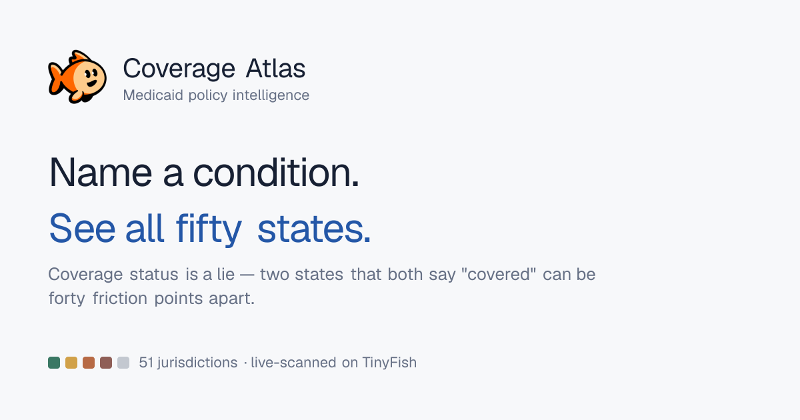
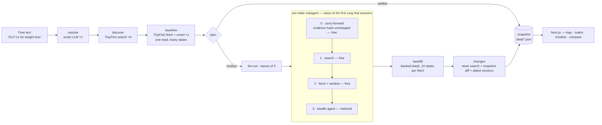

# Coverage Atlas

**Live demo:** _TODO — add the deployed URL before opening the PR_

Coverage Atlas turns a plain-English condition — "GLP-1s for weight loss", "CGMs",
"ABA therapy for autism" — into a live scan of Medicaid coverage policy across all
50 states and DC. Because a coverage label alone is close to meaningless, it
extracts the administrative gates each state actually publishes and scores them:
on GLP-1s, **24 states carry the identical coverage status and sit 54 friction
points apart**. TinyFish does all the collection — `search` discovers sources and
dated announcements, `fetch` reads trackers and state policy documents, and the
stealth `agent` takes over when a state portal 403s a plain fetcher (several do).

## Demo



_TODO — replace with a recorded capture of a live scan: the map repainting state by
state as each jurisdiction lands, then the **Friction** toggle redrawing the country._

## The angle: coverage status is a lie

Every existing tracker answers "is it covered?" Two states can both say **covered**
and be forty points apart in what a patient faces — one requires prior
authorization, a documented failed trial, six months of a supervised program, a
specialist prescriber and quarterly reauthorization; the other puts it on the
pharmacy shelf.

So every jurisdiction gets an **Access Friction Index** (0–100), computed from the
gates its own documents state:

| Gate | Weight | | Gate | Weight |
|---|---:|---|---|---:|
| Prior authorization | 22 | | Renewal under 12 months | 8 |
| Step therapy | 18 | | Quantity limit | 7 |
| Documented prior failure | 14 | | Medical benefit only | 6 |
| Supervised program | 12 | | Restricted diagnosis | 6 |
| Clinical threshold (BMI, A1c…) | 10 | | Age restriction | 5 |
| Specialist prescriber only | 9 | | | |

Weights are additive then squashed, so the first two gates move the score a lot and
the seventh moves it little — which is how access actually fails. The map colours by
**status** or by **friction**, and on most conditions the two maps do not look alike.

Medicaid publishes no cross-state database and no change feed anywhere in the
country, so the delta has to be computed. Every change event says how we know it:

- **observed** — our own snapshot differ caught it between two scans
- **historical** — two dated versions of the state's own policy, read in one scan
  and compared (a bulletin announcing a change states the rule it replaces)
- **reported** — a dated public announcement

## Where the TinyFish API is called

The escalation ladder, cheapest rung first. Full client: [`agent/lib/tinyfish.ts`](./agent/lib/tinyfish.ts).

```ts
// 1. search (free) — find the state's own policy document
const hits = await search(
  `${stateName} Medicaid ${spec.treatmentClass} prior authorization criteria preferred drug list`,
)

// 2. fetch (free) — read the top candidates in ONE call, links included so
//    outbound links become leads for the backfill pass
const docs = await fetchContents(rankPolicyUrls(hits, stateName).slice(0, 3))

// 3. agent (metered) — only when fetch came back empty, which for state
//    Medicaid portals usually means a 403
const result = await runAgent({
  url: target,
  stealth: true,                         // state sites refuse plain fetchers
  goal:
    `Find what this page says about ${stateName} Medicaid fee-for-service coverage of ` +
    `${spec.treatmentClass} for ${spec.name}. Return STRICT JSON only: ` +
    `{"found":boolean,"status":"covered|conditional|limited|not_covered|unpublished",` +
    `"frictionFlags":[...],"criteriaVerbatim":"exact wording or null",` +
    `"effectiveDate":"YYYY-MM-DD or null","otherVersions":[...]}` +
    ` — otherVersions captures any DATED earlier or later version the page describes.`,
  onProgress: (purpose) => emit(purpose),
})
```

`COMPLETED` only means the browser ran without crashing, so every agent result is
validated on content, never on status.

## Architecture

An orchestrator that owns the plan, the budget and the merge, and per-state
subagents that own nothing else. A subagent sees one state and ~2k tokens — never
its siblings' results, the tracker document, or the orchestrator's reasoning.



Bounded by two ceilings — **200 TinyFish calls** and **80 orchestrator steps** —
and it stops early, budget unspent, once every jurisdiction carries a timestamped,
cited answer. Anything unresolved when a ceiling binds is filled from model
knowledge and marked **unverified** everywhere it renders, never passed off as
sourced.

Why it stays cheap, measured on every run against a naive whole-document-per-state
loop:

| Mechanism | Effect |
|---|---|
| One tracker read | Settles most jurisdictions in a single normalisation call |
| Plan only fans out the residue | Confidently-answered states get no per-state call |
| Evidence hashing | Unchanged sources carry forward at zero cost on re-scans |
| Windowing | A 60–120k char drug list becomes ~5k of relevant passages |
| Batched backfill | Ten states' gap-filling leads in one fetch, not ten |
| Two-tier routing | 3–4 smart calls; all volume on the cheap model |

A representative live run: 51/51 jurisdictions sourced, 46 dated, 34 with policy
history, 0 inferred — stopped because every jurisdiction was answered, at 89/200
calls and 41/80 steps, **12.0× cheaper** than the naive loop.

Deeper docs live in [`docs/`](./docs): [architecture](./docs/ARCHITECTURE.md),
[the agent](./docs/AGENT.md), [data model](./docs/DATA-MODEL.md),
[HTTP API](./docs/API.md), [operations](./docs/OPERATIONS.md),
[decisions](./docs/DECISIONS.md).

## How to run

Node 20+ and pnpm.

```bash
pnpm install
cp .env.example .env.local
pnpm dev                       # http://localhost:3000
```

| Env var | Required | Notes |
|---|---|---|
| `TINYFISH_API_KEY` | to scan | Sent as `X-API-Key`. Search and fetch are free; agent runs are metered. |
| `OPENROUTER_API_KEY` | to scan | Normalisation and extraction calls. |
| `OPENROUTER_MODEL_SMART` | no | Default `anthropic/claude-sonnet-4.5`. Resolution, tracker read, change narration — 3–4 calls per scan. |
| `OPENROUTER_MODEL_CHEAP` | no | Default `google/gemini-2.5-flash`. Per-state extraction — all the volume. Must support strict JSON schema output. |

Reading the atlas needs **no keys at all** — a seeded 51-jurisdiction scan is
committed in `data/`, so the app opens with a full map offline. Keys are needed to
run a new scan and to re-verify a state.

Name a condition in the header and press **Run scan**. The same orchestrator runs
headless:

```bash
pnpm scan "GLP-1 drugs for weight loss"
pnpm scan "continuous glucose monitors" --depth deep --agent-budget 10
pnpm scan <saved-slug> --depth baseline --max-calls 120 --max-steps 60
pnpm agent:list        # saved conditions, snapshots, change counts
pnpm agent:ledger      # cost history
```

## Scope and honesty

Medicaid **fee-for-service** only — roughly three quarters of enrollees are in
managed care, which layers its own criteria on top. FFS is the published floor, not
the whole picture. Every record carries its source document, effective date,
extraction confidence, which ladder rung produced it, and a "last verified by our
scanner" timestamp; any record can be re-read live from the drawer. Verify against a
state's official publication before making a clinical or financial decision.

The fish mark is TinyFish's, used here because this is built on TinyFish.
