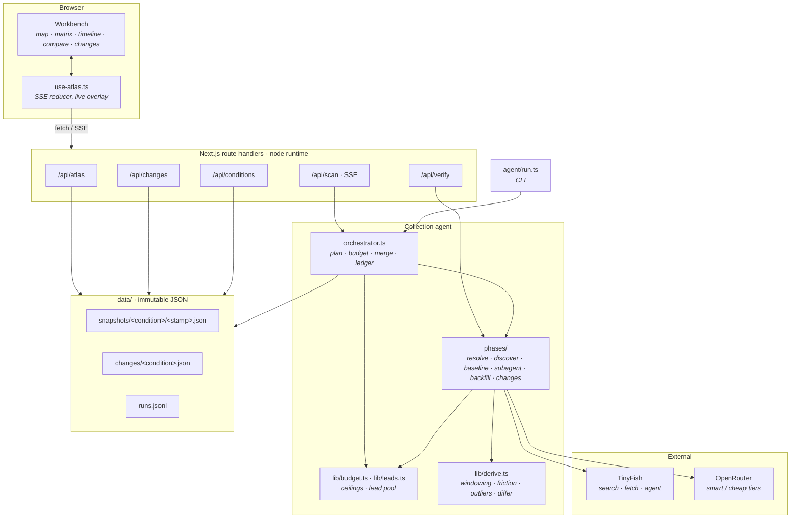

# Architecture

How Coverage Atlas is put together, and why each seam is where it is.

- [The shape of the problem](#the-shape-of-the-problem)
- [Layers](#layers)
- [A scan, end to end](#a-scan-end-to-end)
- [Module boundaries](#module-boundaries)
- [Extraction vs derivation](#extraction-vs-derivation)
- [Failure model](#failure-model)
- [Deployment](#deployment)

Companion documents: [AGENT.md](AGENT.md) for the collection agent in depth,
[DATA-MODEL.md](DATA-MODEL.md) for the types and the friction maths,
[API.md](API.md) for the HTTP surface, [OPERATIONS.md](OPERATIONS.md) for
running and tuning it, [DECISIONS.md](DECISIONS.md) for the calls we made and
what we gave up.

---

## The shape of the problem

Three facts about US Medicaid coverage policy determine the entire design:

1. **There is no cross-state database.** Each of the fifty states plus DC
   publishes its own preferred drug list, prior-authorization criteria and fee
   schedules, independently, in its own format. Several outsource publication to
   a contracted pharmacy benefit manager on a non-`.gov` domain. None expose an
   API.
2. **There is no change feed.** Medicare has one — the Medicare Coverage
   Database publishes a weekly "What's New" report. Medicaid has nothing
   equivalent anywhere in the country. A state that narrows its criteria simply
   republishes a dated PDF.
3. **Many state portals refuse plain fetchers.** Bot protection on state
   Medicaid sites and on `cms.gov` returns 403 to anything that is not a real
   browser.

Fact 1 means the data has to be *collected*, per jurisdiction, from
heterogeneous sources. Fact 2 means the delta has to be *computed*, by holding
two observations side by side — which makes history a first-class storage
concern rather than an afterthought. Fact 3 means the collector needs a browser
escalation path, but only as a last resort, because browsers are the expensive
rung.

## Layers



Four layers, and the boundaries are load-bearing:

**The store is the contract.** Route handlers for reading (`/api/atlas`,
`/api/changes`, `/api/conditions`) never touch TinyFish, OpenRouter, or the
orchestrator. They read files. That is why the atlas loads instantly and why the
demo opens with complete data even with no API keys present.

**The agent is a library, not a service.** `orchestrator.ts` exports a function.
The CLI calls it and the SSE route calls it, with the same options and the same
event stream. There is no second code path to keep in sync, and a scan can be
reproduced headless from a terminal exactly as the UI ran it.

**The UI imports the agent's types directly.** `lib/atlas.ts` re-exports from
`agent/lib/types.ts`, so a field the collector stops writing is a compile error
in the view that renders it. The UI adds labels, colours and small client-side
arithmetic on top; it invents no vocabulary of its own.

## A scan, end to end

```mermaid
sequenceDiagram
    autonumber
    participant U as User
    participant R as /api/scan
    participant O as Orchestrator
    participant S as Subagents ×N
    participant T as TinyFish
    participant M as OpenRouter
    participant D as data/

    U->>R: POST {condition:"GLP-1s for weight loss", depth:"standard"}
    R->>O: scan(opts) — SSE begins
    O->>M: resolve free text → condition spec (smart, ×1)
    O-->>U: condition
    O->>T: search ×4 — biased to multi-state documents
    O->>M: rank sources (cheap, ×1)
    O->>T: fetch top trackers
    O->>M: normalise one tracker → up to 51 rows (smart, ×1)
    O-->>U: plan {fromBaseline, toFanOut}
    loop waves of 5, while budget allows
        O->>S: {state, spec, baseline row, prior record, budget, leads}
        S->>T: search → state's own policy document
        S->>T: fetch → markdown (+ outbound links banked as leads)
        Note over S: window to passages naming the drug;<br/>hash unchanged ⇒ carry forward, 0 tokens
        alt fetch blocked (403)
            S->>T: agent (stealth + US proxy) — metered, budgeted
        else evidence in hand
            S->>M: extract criteria + dated versions (cheap, ×1)
        end
        S-->>O: CoverageRecord (with history)
        O-->>U: state {record, done, total}
    end
    loop backfill rounds, while gaps remain and budget allows
        O->>T: one batched fetch — 10 banked leads across 10 states
        O->>M: extract into the gaps (cheap, ×n)
        O-->>U: state {record} — revised in place
    end
    alt every jurisdiction answered
        Note over O: stop early, budget unspent
    else ceiling bound with states unresolved
        O->>M: infer remaining (smart, ×1) — marked unverified
    end
    O->>T: news search — dated announcements
    O->>M: normalise reported changes (smart, ×1)
    O->>O: diff previous snapshot · diff dated versions within this scan
    O->>D: write snapshot · merge changes · append ledger
    O-->>U: complete {ledger, outliers}
```

Each state lands as its own SSE event, so the choropleth repaints jurisdiction by
jurisdiction. The plan event fires *before* the fan-out, which means the ratio
that justifies the whole design — how many states one shared read settled versus
how many needed their own subagent — is visible while it happens rather than
asserted afterwards.

If the viewer navigates away mid-scan the stream closes but the scan continues
headless. It is writing a snapshot either way, and a half-written scan is worse
than one nobody watched.

The whole run is bounded by two ceilings — 200 TinyFish calls and 80 orchestrator
steps — and stops early, before either binds, once every jurisdiction carries a
timestamped, cited answer. See [AGENT.md](AGENT.md#budgets-and-termination).

## Module boundaries

| Module | Owns | Must not |
|---|---|---|
| `agent/orchestrator.ts` | The plan, the metered budget, wave scheduling, merging, the ledger | Extract anything, or call a model about a specific state |
| `agent/phases/resolve.ts` | Free text → `ConditionSpec` | Know about states or sources |
| `agent/phases/discover.ts` | Finding and ranking sources | Read policy substance |
| `agent/phases/baseline.ts` | One multi-state read → many rows | Fan out, or hold per-state state |
| `agent/phases/subagent.ts` | One state, the escalation ladder, one record | See another state, the tracker document, or the orchestrator's reasoning |
| `agent/phases/backfill.ts` | Closing gaps by following banked leads; the post-cap inference pass | Re-do work the fan-out already did well |
| `agent/phases/changes.ts` | Dated public announcements | Compute observed or historical deltas |
| `agent/lib/budget.ts` | The two ceilings and the stop reason | Know what it is bounding |
| `agent/lib/leads.ts` | Ranking and dedup of candidate URLs across the run | Fetch anything itself |
| `agent/lib/derive.ts` | Windowing, friction, outliers, the differ | Perform I/O or call a model |
| `agent/lib/tinyfish.ts` | The three primitives, retries, SSE parsing | Know what a condition is |
| `agent/lib/llm.ts` | OpenRouter, tier routing, the token ledger | Know what a state is |
| `agent/lib/store.ts` | Snapshot files, change feeds, the run log | Compute anything |

The rule the subagent boundary enforces is worth stating plainly: **nothing
about Ohio's job requires knowing anything about Nevada.** A shared conversation
that accumulated all fifty-one states would cost quadratically and buy no
accuracy, so the subagent's context is deliberately capped at its own state,
its own evidence excerpt and the one baseline row that concerns it.

`lib/derive.ts` being pure — no I/O, no model calls — is what makes the friction
index, the outliers and the deltas reproducible from stored snapshots alone.
Anyone can recompute them from `data/` and get the same numbers.

## Extraction vs derivation

Every number in the product falls on one side of this line, and the split is the
main reason the output can be defended:

**Extraction** is anything a model states about a jurisdiction: coverage status,
which gates the document describes, verbatim criteria, effective and document
dates, and any dated earlier or later version the document describes. It comes
from a source, carries a URL and a document title, and is stamped with a
confidence and the ladder rung that produced it. A subagent that cannot find
evidence returns `unpublished` rather than a guess — "no published
fee-for-service policy" is a real and reportable finding, and several states
genuinely leave this to their managed-care plans.

There is exactly one exception, and it is fenced off: when the budget closes with
jurisdictions still unresolved, a final pass fills them from the model's own
knowledge as `method: "inferred"`, with no source URL, `review_needed`
confidence, and a note saying so. The interface marks these everywhere they
appear. An honest low-confidence cell beats a hole, but only if it is never
mistaken for a sourced one.

**Derivation** is anything Coverage Atlas asserts *across* jurisdictions:
friction scores, peer outliers, spread within a status, the delta. This is
arithmetic over the extracted citations, in pure functions, with no model
involved. It is deterministic and reproducible offline.

The product's opinions live entirely in derivation. That is deliberate: the
claim "these two states both say covered and are forty points apart" is only
worth making if the forty is arithmetic anyone can check, not a model's
impression.

## Failure model

Degradation is per-state and per-rung, never global.

- **One state failing must not cost the other fifty.** Every wave is
  `Promise.allSettled`; a rejected subagent falls back to its baseline row, then
  to its prior record, then to an `unpublished` record, and the failure is
  recorded in the run ledger rather than thrown.
- **Each rung of the ladder degrades into the next.** No search results is not
  an error, it just means the baseline row stands. A fetch that returns a thin
  landing page that never names the drug is treated as the wrong page, not as
  evidence of non-coverage.
- **`COMPLETED` is not success.** A TinyFish agent run that finishes without
  crashing can still return nothing useful, so agent results are validated on
  content and discarded if `found` is false.
- **Model calls retry, then stop.** Transport failures and 429/5xx back off
  exponentially; a 4xx will not fix itself and fails immediately. A model that
  returns prose instead of JSON twice is one we stop paying for rather than one
  we keep coaxing.
- **Running out of budget is a normal ending, not an error.** Both ceilings are
  checked before spending, never after, and a phase that cannot afford its whole
  batch skips it rather than spending part of it.
- **A changed status is an alert, so borderline calls are sticky.** The
  baseline prompt is given the statuses we already hold and instructed to keep
  them unless the document plainly contradicts them, and the differ ignores
  friction movements under six points as extraction noise. A scanner that cries
  wolf is worse than no scanner.

## Deployment

The app is a standard Next.js application; the only unusual requirement is that
scan and verify routes need the Node runtime and a long `maxDuration`
(800s and 300s respectively), because the work happens inside the streaming
request rather than in a job queue.

`data/` is read at request time from `process.cwd()`, and written by scans. On a
read-only filesystem the atlas still serves the committed snapshots — reading,
comparing and time-travelling all work — but scanning and re-verification do
not. For a demo, running locally or on a host with a writable working directory
keeps the whole product live.
