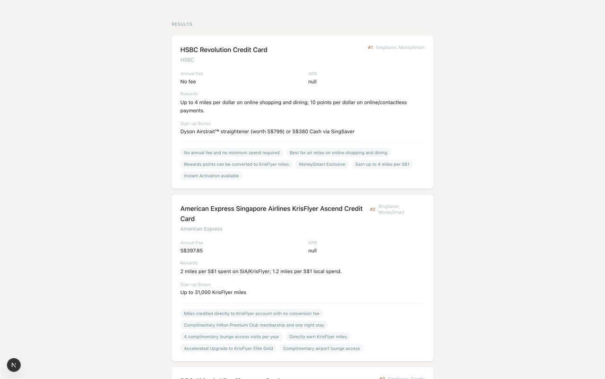
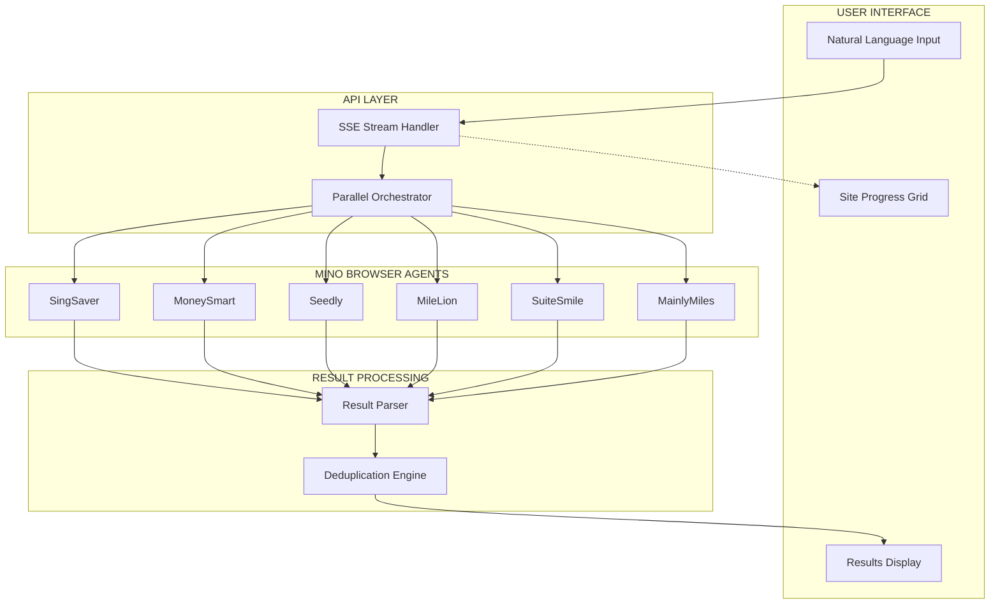
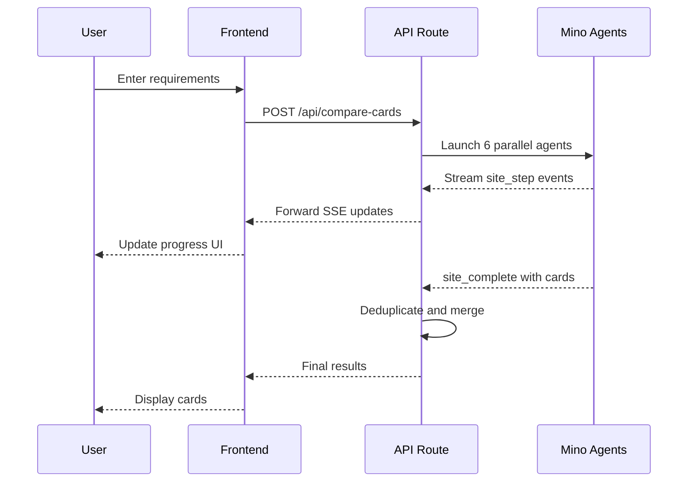
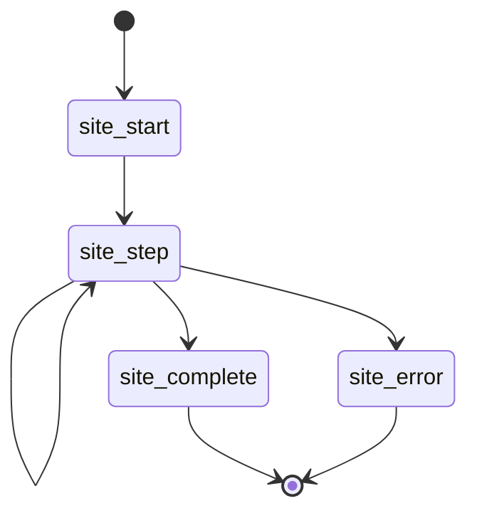
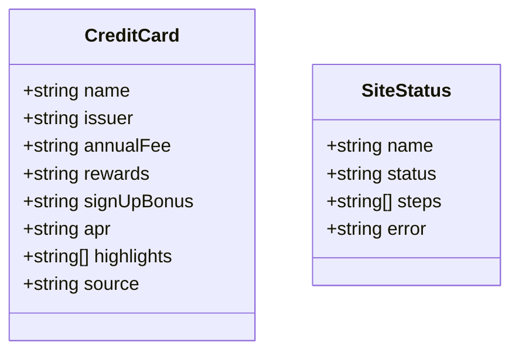

# TinyFish - Singapore Credit Card Aggregator

## Demo



**Live Demo:** https://credit-aggregator.vercel.app/

A real-time credit card comparison tool that aggregates data from 6 major Singapore financial comparison websites using parallel Mino browser agents. Users describe their requirements in natural language, and the system dispatches concurrent AI agents to scrape and consolidate matching credit cards.

**Status**: ✅ Working

---

## Demo

*[Demo video/screenshot to be added]*

---

## How Mino API is Used

The Mino API powers browser automation for this use case. See the code snippet below for implementation details.

### Code Snippet

```bash
npm install
export MINO_API_KEY=your_api_key
npm run dev
```

---

## How to Run

### Prerequisites

- Node.js 18+
- Mino API key (get from [mino.ai](https://mino.ai))

### Setup

1. Clone the repository:
```bash
git clone https://github.com/tinyfish-io/TinyFish-cookbook
cd TinyFish-cookbook/credit-aggregator
```

2. Install dependencies:
```bash
npm install
```

3. Create `.env.local` file:
```bash
# Add your environment variables here
MINO_API_KEY=sk-mino-...
```

4. Run the development server:
```bash
npm run dev
```

5. Open [http://localhost:3000](http://localhost:3000) in your browser

---

## Architecture Diagram










