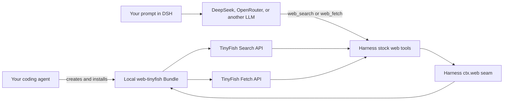

# Add TinyFish Search and Fetch to DeepSeek Harness with a coding agent

- **Live project:** [DeepSeek Harness](https://github.com/deepseek-ai/deepseek-harness)
- **TinyFish APIs:** [Search](https://docs.tinyfish.ai/search-api) and [Fetch](https://docs.tinyfish.ai/fetch-api)

This is a prompt-first integration recipe. Paste the prompt below into Codex, Claude Code, Cursor, or another coding agent with terminal access. The agent will inspect the version of DeepSeek Harness on your machine, build a local TinyFish provider, install it into your `web` profile, and prove that both tools work.

No published TinyFish DSH package or DeepSeek Harness fork is required. You need Node.js, `pnpm`, a TinyFish API key, and an LLM configured in Harness. DeepSeek and OpenRouter are both valid LLM choices; TinyFish supplies the web Search and Fetch capabilities, not the model.

> DeepSeek Harness is a developer preview, so its plugin interfaces may change. The prompt deliberately makes your coding agent inspect the current interfaces instead of copying a version-pinned plugin.

## Paste this into your coding agent

```text
Integrate TinyFish Search and Fetch into the official DeepSeek Harness (`dsh`)
on this machine. Complete the implementation and tests for me; do not stop at
instructions or a code sample.

Goal

- Keep DeepSeek Harness's existing model-facing `web_search` and `web_fetch`
  tools.
- Register TinyFish as the native `ctx.web` provider behind both tools.
- Install the integration locally into my DSH `web` profile.
- Do not publish an npm package, push code, open a PR, or modify the upstream
  DeepSeek Harness repository.

Before coding

1. Check `node --version`, `pnpm --version`, and the installed/current
   `@deepseek-ai/dsh` version. DeepSeek Harness is a developer preview, so do
   not assume old interfaces still work.
2. Read the current official DeepSeek Harness plugin publishing guide and the
   source/types for `@deepseek-ai/dsh-web`, `@deepseek-ai/dsh-tool-web`, and
   `@deepseek-ai/dsh-launch-environment`.
3. Use an existing native web-provider integration such as Firecrawl's DSH
   provider as a structural precedent, but implement TinyFish's current API
   contract from the official TinyFish Search and Fetch documentation.
4. Create the provider in a stable local directory that will not be deleted or
   moved. Do not use `/tmp`. Do not disturb unrelated repositories or changes.

Implementation requirements

1. Create a local TypeScript Cordis/DSH plugin named `web-tinyfish` with
   provider ID `tinyfish`.
2. Register both a `WebSearchProvider` and a `WebFetchProvider` on `ctx.web`.
3. Read the credential from `TINYFISH_API_KEY` through the Harness launch
   environment. An optional plugin config value may override it for tests, but
   never hardcode a credential.
4. TinyFish Search:
   - Send `GET https://api.search.tinyfish.ai`.
   - Authenticate with `X-API-Key`.
   - Send the Harness query as the `query` parameter.
   - Support currently documented optional Search parameters when configured.
   - Normalize each valid TinyFish result into the current Harness source
     shape, including URL and any available title, snippet, or date.
   - Let the Harness web seam enforce its requested result limit.
5. TinyFish Fetch:
   - Send `POST https://api.fetch.tinyfish.ai`.
   - Authenticate with `X-API-Key` and send JSON.
   - Request one URL as clean markdown using the current documented request
     fields. Do not request link or image-link expansion unless required.
   - Map a successful `results[]` entry to the current Harness fetch-result
     shape, preserving the final URL, HTTP status semantics, text body, and
     truncation state.
   - Treat a TinyFish per-URL `errors[]` entry as a real structured failure;
     handle documented errors such as timeout, bot_blocked, empty_content,
     invalid_url, proxy_error, and fetch_error.
6. Forward the Harness AbortSignal to both network calls. Map cancellation and
   provider failures to stable Harness/Web error codes.
7. Do not follow redirects on requests carrying the TinyFish API key. Require
   HTTPS for credential-bearing remote endpoints, validate fetched/resource
   URLs as HTTP or HTTPS, reject embedded URL credentials, cap retained body
   characters, and never include the API key in an error or log.
8. Add a DSH Bundle patch that:
   - selects `tinyfish` as both `searchProvider` and `fetchProvider` on the
     existing `@deepseek-ai/dsh-web` row; and
   - inserts the local `web-tinyfish` plugin row.
9. Build the plugin before installing it. Install it with the official local
   Bundle flow, equivalent to:
   `dsh plugin --profile web add <absolute-local-plugin-path>`
   Use `npx @deepseek-ai/dsh` if `dsh` is not installed globally. Remember that
   the DSH plugin command requires `pnpm` on PATH.

Credential handling

- If `TINYFISH_API_KEY` is missing, pause only to ask me to export it in the
  shell that will launch DSH.
- Never print, echo, commit, or place the key in source, YAML, command history,
  test snapshots, or the final report.
- An `.env.example` may contain only `TINYFISH_API_KEY=your_api_key_here`.

Required verification

1. Run TypeScript type-checking and the production build.
2. Add network-free tests for Search request/response mapping, Fetch
   request/response mapping, malformed envelopes, TinyFish per-URL errors,
   cancellation, unsafe URLs/endpoints, and body truncation.
3. Add an integration test using the real Harness `Context`, web runtime,
   tool runtime, stock `web_search`/`web_fetch` tools, and
   `ctx.tools.execute()`, with only the external HTTP boundary mocked. Confirm
   that Harness result limits are applied.
4. With my TinyFish key, make fresh live calls through `ctx.tools.execute()`:
   - `web_search` must return at least one source and respect a three-source cap.
   - `web_fetch` must fetch `https://docs.tinyfish.ai/search-api`, return HTTP
     200, and contain non-empty extracted text.
5. Test installation in a temporary, isolated `DSH_HOME` first. Inspect
   `dsh --profile web --dump-config` and prove that both provider selections
   and the `web-tinyfish` row are present.
6. Launch that isolated profile with `dsh web --no-open` on an available local
   port and confirm the Web UI returns HTTP 200. Stop it cleanly afterward.
7. Only after those checks pass, install the same local Bundle into my real
   `web` profile. Do not overwrite unrelated profile customizations.

Final report

- Give me the stable local plugin path and the exact command to launch DSH.
- Report the exact number of passing tests.
- Report the observed live Search source count and Fetch status/body length.
- Distinguish mocked tests, live TinyFish calls, and the DSH Web UI check.
- State clearly that TinyFish Agent and Browser automation were not added;
  this integration covers the native Search and Fetch primitives only.
- If any required check did not pass, say so instead of claiming the
  integration works.
```

## What the agent should build



The local Bundle should select TinyFish without replacing the Harness tools:

```yaml
- id: web
  name: '@deepseek-ai/dsh-web'
  config:
    searchProvider: tinyfish
    fetchProvider: tinyfish

- insert:
    - id: web-tinyfish
      name: '<the local plugin package name>'
```

## Try it

After the agent finishes, launch the Harness Web UI and start a standard session:

```bash
export TINYFISH_API_KEY="your_tinyfish_key"
npx @deepseek-ai/dsh web
```

Then ask:

```text
Search for the latest TinyFish Search API documentation, fetch the most
relevant official page, and summarize it with source links.
```

A working integration will show the stock Harness `web_search` and `web_fetch` calls, cite Search results, and return the fetched page as extracted markdown.

## Scope

This recipe integrates TinyFish's Search and Fetch APIs. TinyFish Agent and Browser automation expose a much larger tool surface and are intentionally left to TinyFish's MCP server and SDKs.
