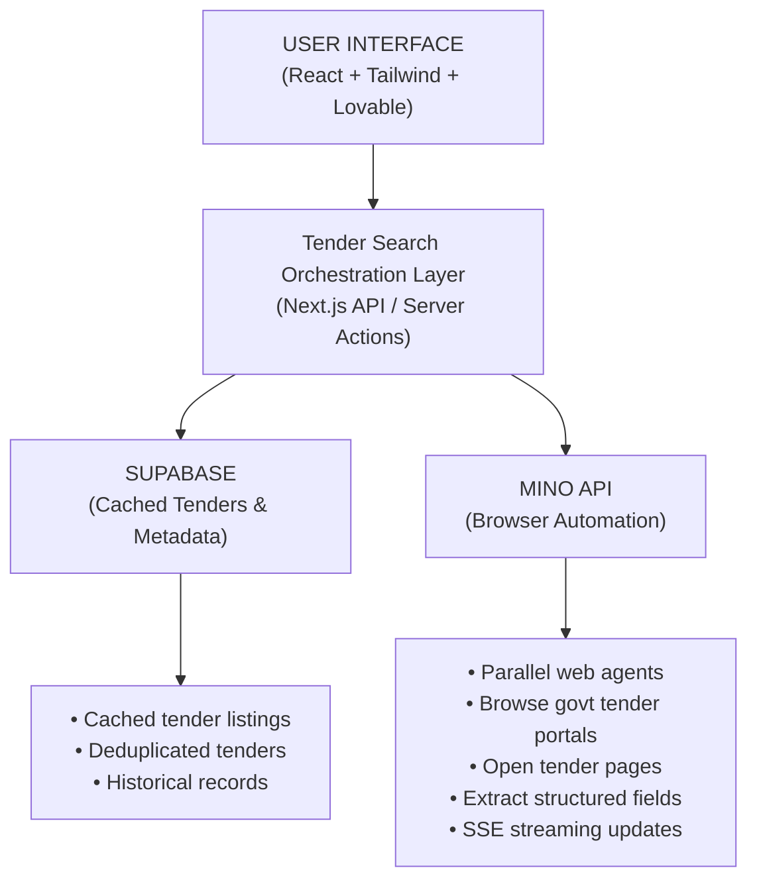

# Project Title - Government Tender Finder for Singapore 

**Live Link**: https://tender-scout-singapore.lovable.app


## What This Project Is -
This project is an AI-powered summer school discovery and comparison tool that automatically finds, scans, and extracts information from official summer school websites worldwide.
Instead of relying on outdated lists or manual searches, the app pulls live data directly from source websites and returns it in a clean, structured format. 

## What This Project Is -

**AI-based Link Discovery**

The system first uses an AI layer to identify and curate relevant summer school websites based on the user’s query (region, subject, age group, duration, etc.).

**Automated Web Browsing with TinyFish**
The curated links are passed to the TinyFish Web Agent API, which launches multiple browser agents in parallel to:

1) Navigate dynamic pages

2) Handle real websites (no static scraping)

3) Extract structured details such as program name, location, dates, eligibility, fees, and deadlines

**Real-Time Streaming & Aggregation**
Progress updates are streamed via SSE, and extracted results are normalised into a unified JSON format for easy comparison.

## What to Expect

1) Live, up-to-date data pulled directly from official websites

2) Parallel web scanning for fast results

3) Real-time status updates during execution

4) Structured, comparable output (JSON)


**Demo Video** - https://drive.google.com/file/d/1GXZhJOjiVUP5XcGvTAvRGcYhTWoKXlsE/view?usp=sharing


## Code snippet - 
```bash
const response = await fetch("https://mino.ai/v1/automation/run-sse", {
  method: "POST",
  headers: {
    "Content-Type": "application/json",
    "X-API-Key": "sk-mino-YOUR_API_KEY",
  },
  body: JSON.stringify({
    url: "https://www.gebiz.gov.sg",
    goal: "Extract the latest open government tenders. Return JSON with tenderTitle, agency, tenderID, procurementCategory, submissionDeadline, eligibilityCriteria, estimatedValue, tenderStatus, and tenderLink.",
    browser_profile: "lite",
  }),
});

const reader = response.body!.getReader();
const decoder = new TextDecoder();

while (true) {
  const { done, value } = await reader.read();
  if (done) break;

  const chunk = decoder.decode(value);
  for (const line of chunk.split("\n")) {
    if (line.startsWith("data: ")) {
      const data = JSON.parse(line.slice(6));

      // Live browser view
      if (data.streamingUrl) {
        console.log("Live view:", data.streamingUrl);
      }

      // Final structured output
      if (data.type === "COMPLETE" && data.resultJson) {
        console.log("Extracted tenders:", data.resultJson);
      }
    }
  }
}
```


## Tech Stack
**Next.js (TypeScript)**

**Mino API**

**AI**

## Architecture Diagram

