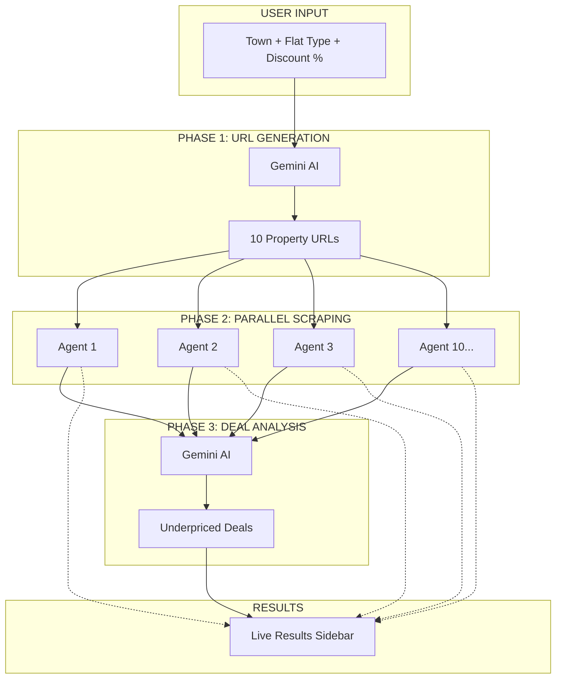
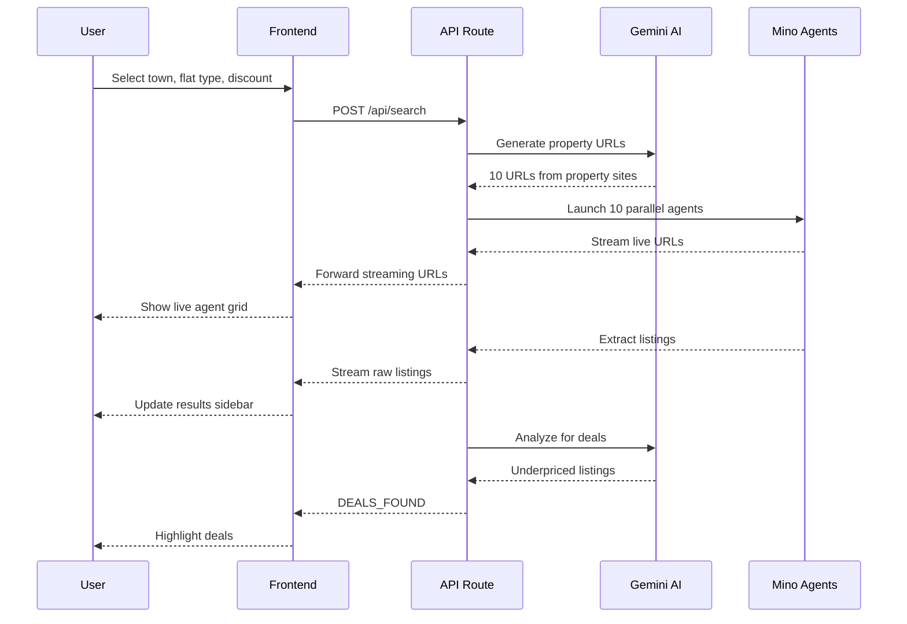
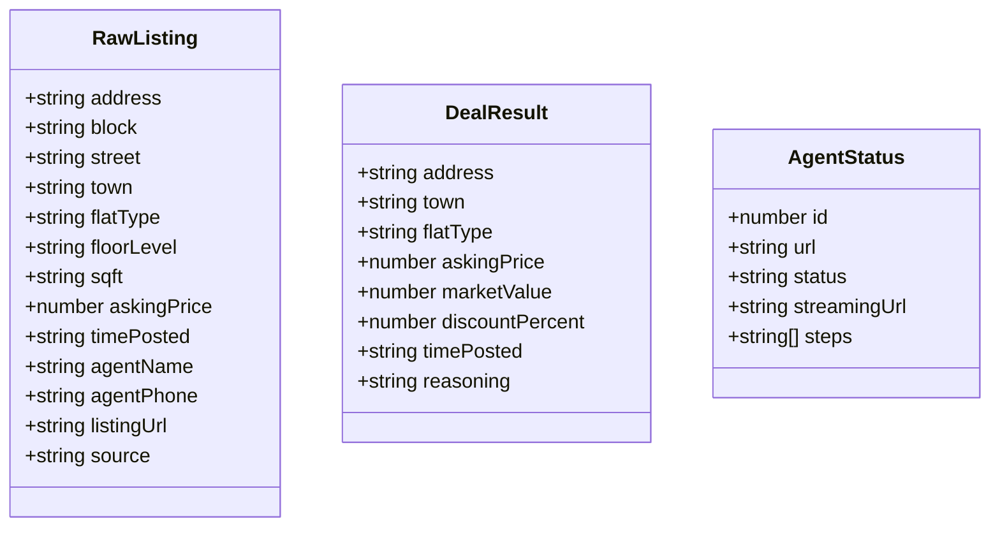

# TinyFish - HDB Deal Sniper

**Live Demo:** https://home-snipe.vercel.app

Real-time Singapore HDB resale deal finder that uses the **Source → Extract → Present** pipeline pattern. Gemini generates property listing URLs, Mino browser agents scrape them in parallel, and Gemini analyzes results to identify underpriced deals.

**Status**: ✅ Working

---

## Demo

*[Demo video/screenshot to be added]*

---

## How Mino API is Used

The Mino API powers browser automation for this use case. See the code snippet below for implementation details.

### Code Snippet

```bash
npm install
export MINO_API_KEY=your_key
export GEMINI_API_KEY=your_key
npm run dev
```

---

## How to Run

### Prerequisites

- Node.js 18+
- Mino API key (get from [mino.ai](https://mino.ai))

### Setup

1. Clone the repository:
```bash
git clone https://github.com/tinyfish-io/TinyFish-cookbook
cd TinyFish-cookbook/home-snipe
```

2. Install dependencies:
```bash
npm install
```

3. Create `.env.local` file:
```bash
MINO_API_KEY=xxx      # Browser automation
GEMINI_API_KEY=xxx    # URL generation + deal analysis
```

4. Run the development server:
```bash
npm run dev
```

5. Open [http://localhost:3000](http://localhost:3000) in your browser

---

## Architecture Diagram








