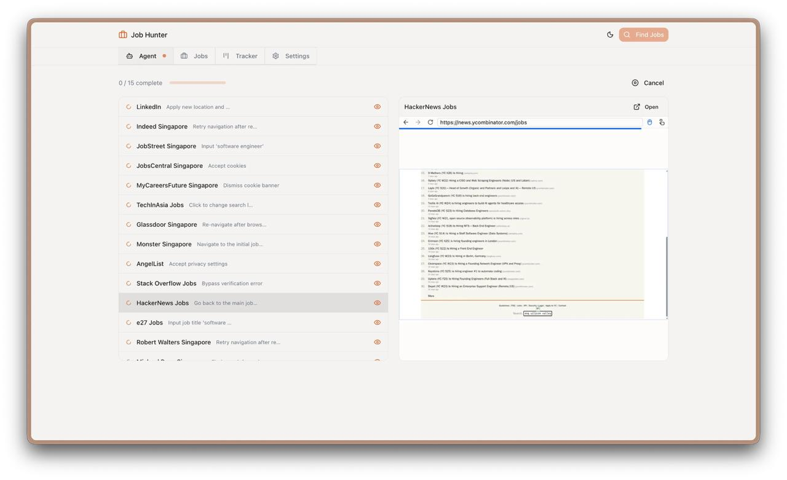
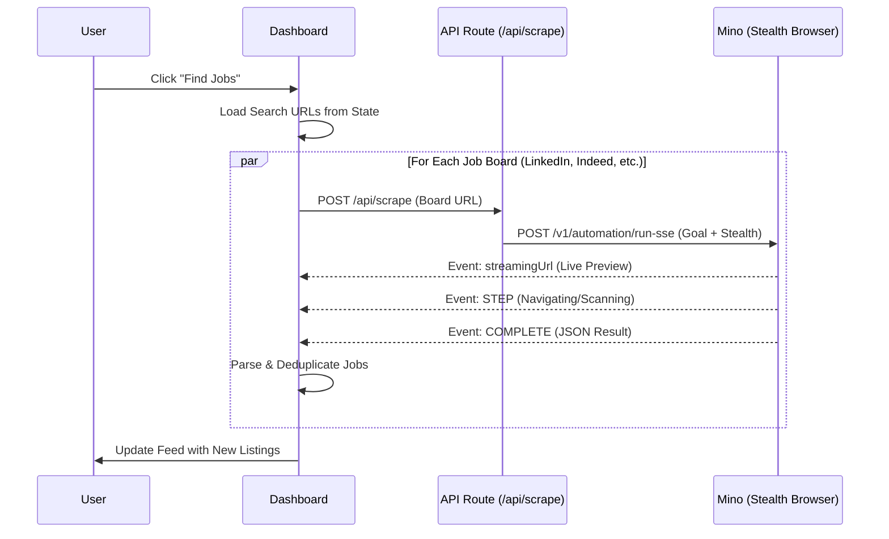

# Job Hunter - AI-Powered Job Search Automation

## Demo



**Live Demo:** https://job-huntboard.vercel.app

Job Hunter is a comprehensive platform that automates the job search process using Mino's browser automation API and OpenRouter's AI models. It handles everything from resume parsing and optimized job board search generation to parallel scraping and intelligent job matching.

---

---

## Demo

*[Demo video/screenshot to be added]*

---

## How Mino API is Used

The Mino API powers browser automation for this use case. See the code snippet below for implementation details.

### Code Snippet

```bash
curl -N -X POST "https://mino.ai/v1/automation/run-sse" \
  -H "X-API-Key: $MINO_API_KEY" \
  -H "Content-Type: application/json" \
  -d '{
    "url": "https://sg.indeed.com/jobs?q=frontend+developer",
    "goal": "I am looking for: frontend developer. Extract ONLY the 6-7 most relevant job listings...",
    "browser_profile": "stealth"
  }'
```

---

## How to Run

### Prerequisites

- Node.js 18+
- Mino API key (get from [mino.ai](https://mino.ai))

### Setup

1. Clone the repository:
```bash
git clone https://github.com/tinyfish-io/TinyFish-cookbook
cd TinyFish-cookbook/job-hunting
```

2. Install dependencies:
```bash
npm install
```

3. Create `.env.local` file:
```bash
# Add your environment variables here
MINO_API_KEY=sk-mino-...
```

4. Run the development server:
```bash
npm run dev
```

5. Open [http://localhost:3000](http://localhost:3000) in your browser

---

## Architecture Diagram

```mermaid
graph TD
    subgraph Frontend [Next.js Client]
        UI[User Interface - React/Tailwind]
        State[State Management - Custom Hooks]
        LS[(Local Storage)]
    end

    subgraph Backend [Next.js API Routes]
        Parse[/api/ai/parse-resume]
        GenURLs[/api/ai/generate-urls]
        Scrape[/api/scrape]
        Match[/api/ai/match-jobs]
        Letter[/api/ai/cover-letter]
    end

    subgraph External_APIs [External Services]
        Mino[Mino API - Browser Automation]
        OpenRouter[OpenRouter AI - Minimax M2.1]
    end

    %% User Interactions
    UI -->|Resume Text| State
    UI -->|Search Criteria| State
    
    %% Internal Orchestration
    State <-->|Read/Write Profile & Jobs| LS
    State -->|Trigger| Parse
    State -->|Trigger| GenURLs
    State -->|Trigger Parallel| Scrape
    State -->|Trigger| Match
    State -->|Trigger| Letter

    %% External Service Calls
    Parse -->|Extract JSON| OpenRouter
    GenURLs -->|Generate Search URLs| OpenRouter
    Match -->|Analyze Fit| OpenRouter
    Letter -->|Personalize Content| OpenRouter
    
    Scrape -->|Orchestrate Agents| Mino
    Mino --.->|SSE Stream: Progress + Live Preview| UI
    Mino --.->|JSON Result| Scrape
    Scrape -->|Job Objects| State
```




