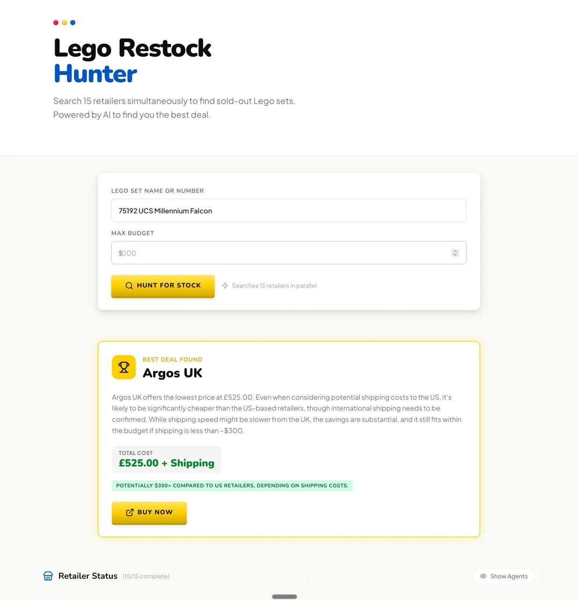
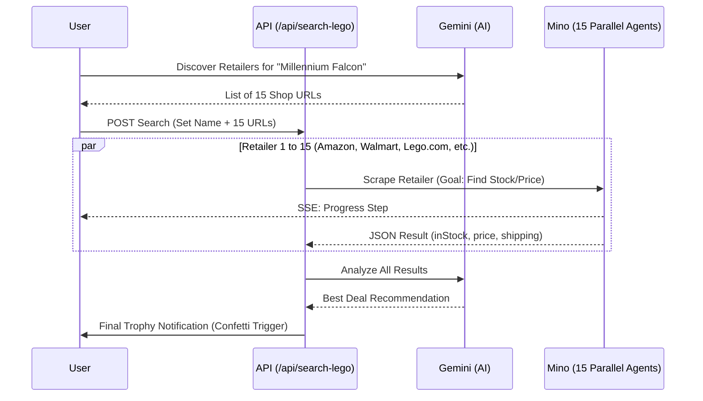

# Lego Restock Hunter - Global Inventory Finder

## Demo



**Live Demo:** https://lego-hunter.vercel.app/

The Lego Restock Hunter is a powerful inventory search tool designed to find rare or sold-out Lego sets across 15+ global retailers simultaneously. It uses AI to discover the best retailers for a specific set, deploys parallel Mino browser agents to check stock and pricing, and finishes with a Gemini-powered analysis to recommend the single best deal (balancing price and shipping).

---

---

## Demo

*[Demo video/screenshot to be added]*

---

## How Mino API is Used

The Mino API powers browser automation for this use case. See the code snippet below for implementation details.

### Code Snippet

```bash
curl -N -X POST "https://mino.ai/v1/automation/run-sse" \
  -H "X-API-Key: $MINO_API_KEY" \
  -H "Content-Type: application/json" \
  -d '{
    "url": "https://www.lego.com/en-us/search?q=75192",
    "goal": "Search for Millennium Falcon Lego set. Extract inStock, price, and shipping. Return JSON.",
    "browser_profile": "lite"
  }'
```

---

## How to Run

### Prerequisites

- Node.js 18+
- Mino API key (get from [mino.ai](https://mino.ai))

### Setup

1. Clone the repository:
```bash
git clone <repo-url>
cd lego-hunter
```

2. Install dependencies:
```bash
npm install
```

3. Create `.env.local` file:
```bash
# Add your environment variables here
MINO_API_KEY=sk-mino-...
```

4. Run the development server:
```bash
npm run dev
```

5. Open [http://localhost:3000](http://localhost:3000) in your browser

---

## Architecture Diagram

```mermaid
graph TD
    subgraph Frontend [Next.js Client]
        UI[User Interface - Lego Brick Style]
        State[Retailer Status & Best Deal]
    end

    subgraph Backend [Next.js API Routes]
        UrlGen[/api/generate-urls]
        Search[/api/search-lego]
    end

    subgraph External_APIs [External Services]
        Gemini[Gemini 2.0 - URL Gen & Analysis]
        Mino[Mino API - Browser Automation]
    end

    %% User Interactions
    UI -->|Lego Set Name| UrlGen
    UrlGen -->|AI Discovery| Gemini
    
    %% Scrape Phase
    UrlGen -->|Return 15 URLs| UI
    UI -->|Trigger Parallel Scrape| Search
    
    Search -->|Deploy 15 Agents| Mino
    Mino --.->|SSE Streams| UI
    Mino --.->|Product JSON| Search

    %% Final Analysis
    Search -->|Analyze All Deals| Gemini
    Gemini -->|Best Retailer Recommendation| Search
    Search --.->|Final Best Deal Event| UI
```




