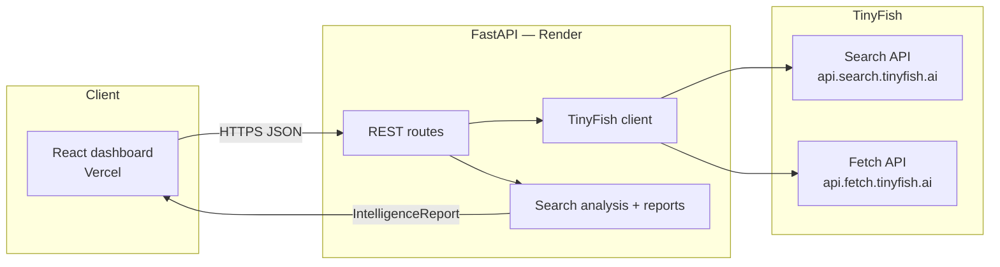

# MonAI

**Live demo: [mon-ai-alpha.vercel.app](https://mon-ai-alpha.vercel.app)**

**Vietnam food-trend intelligence for F&B brands — menu gaps, forecasts, regional compare, supplier discovery, and RFQ outreach.**

MonAI uses **TinyFish Search** (`api.search.tinyfish.ai`) to scan live Vietnamese web signals (social, delivery apps, operator menus) and **TinyFish Fetch** (`api.fetch.tinyfish.ai`) to extract competitor menu pages as clean markdown. A FastAPI backend structures results into executive-ready reports; a React dashboard lets product teams run analyses without writing prompts.

## Demo

**[Try the live app →](https://mon-ai-alpha.vercel.app)** — open **Dashboard**, run Menu Gap or Forecast, and view formatted intelligence reports.

> Screen recording: use the live demo above for the full walkthrough (landing page → trend board → analysis console).

## TinyFish API usage

Search powers emerging trends, forecasts, menu-gap signals, regional comparisons, and supplier discovery. Fetch reads competitor menu URLs when provided.

```python
# app/services/tinyfish_client.py

async def search_tinyfish(query: str, max_results: int = 10, *, location: str | None = None, ...) -> dict:
    params = {
        "query": query,
        "location": location or "VN",
        "language": language or "vi",
    }
    async with httpx.AsyncClient(timeout=30.0) as client:
        response = await client.get("https://api.search.tinyfish.ai", params=params, headers=_headers())
        response.raise_for_status()
        return response.json()

async def fetch_tinyfish(url: str, *, format: str = "markdown") -> dict:
    payload = {"urls": [url], "format": format}
    async with httpx.AsyncClient(timeout=60.0) as client:
        response = await client.post(
            "https://api.fetch.tinyfish.ai",
            json=payload,
            headers={**_headers(), "Content-Type": "application/json"},
        )
        response.raise_for_status()
        return response.json()
```

Example search query from the trends route:

```python
data = await search_tinyfish(
    f"emerging food beverage trends {location} {category} Vietnam 2025",
    max_results=10,
    location="VN",
    language="vi",
)
```

## How to run

### Prerequisites

- Python 3.12+
- Node.js 20+
- [TinyFish API key](https://agent.tinyfish.ai/) (Search + Fetch are free)

### Backend

```bash
cd monai
cp .env.template .env
# Set TINYFISH_API_KEY and ALLOWED_ORIGINS in .env

pip install -r requirements.txt
uvicorn main:app --reload --port 8000
```

### Frontend

```bash
cd monai/frontend
cp .env.example .env
# VITE_API_BASE_URL=http://localhost:8000

npm install
npm run dev
```

Open [http://localhost:5173](http://localhost:5173).

### Environment variables

| Variable | Required | Description |
|----------|----------|-------------|
| `TINYFISH_API_KEY` | Yes | TinyFish API key |
| `ALLOWED_ORIGINS` | Yes | Comma-separated CORS origins (e.g. `http://localhost:5173`) |
| `OPENAI_API_KEY` | No | Optional richer synthesis; core flows work with TinyFish only |
| `VITE_API_BASE_URL` | Yes (frontend) | Backend URL (e.g. `http://localhost:8000` or your Render URL) |

## Architecture



### Analysis flows

| Feature | TinyFish endpoint | What it does |
|---------|-------------------|--------------|
| Emerging trends | Search | Rank live F&B signals for a city/category |
| Trend forecast | Search | Estimate adoption timeline from web evidence |
| Menu gap | Search + Fetch | Benchmark menu vs trends; fetch competitor URLs |
| Regional compare | Search | Side-by-side city intelligence |
| Supplier discovery | Search | Rank wholesale/supplier candidates |
| RFQ outreach | — | Bilingual templates (optional OpenAI polish) |

## Deployment

- **Frontend:** Vercel — root `frontend/`, set `VITE_API_BASE_URL`
- **Backend:** Render — `render.yaml` included, set `TINYFISH_API_KEY` + `ALLOWED_ORIGINS`

## Project structure

```
monai/
├── app/
│   ├── routes/          # trends, analysis, suppliers
│   └── services/        # tinyfish_client, search_analysis, report_builder
├── frontend/            # React 19 + TanStack Router + shadcn/ui
├── main.py
├── requirements.txt
└── render.yaml
```
