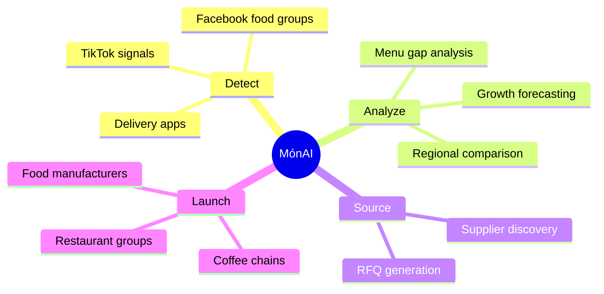
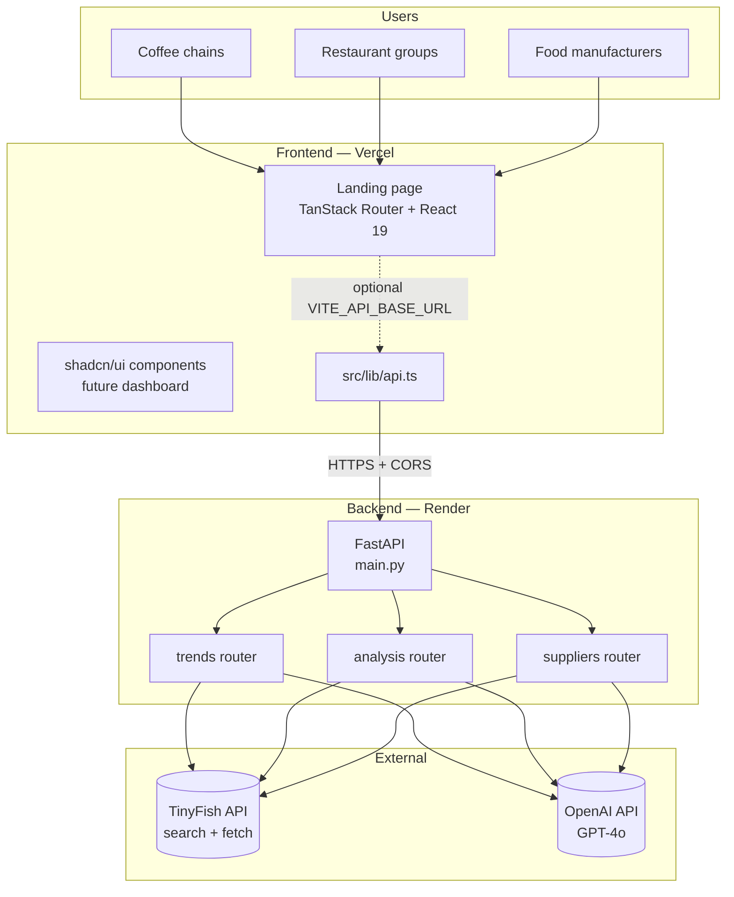
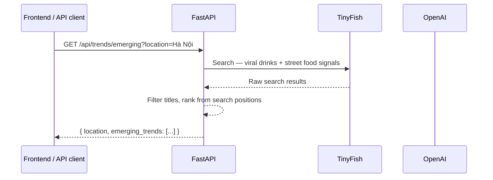
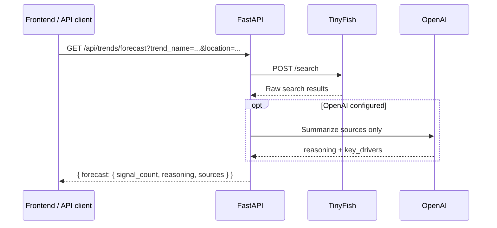
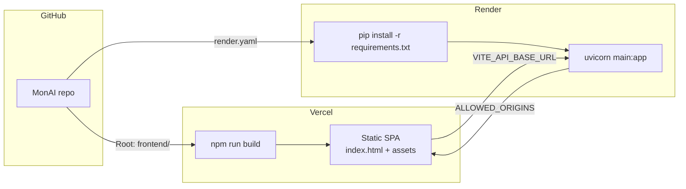
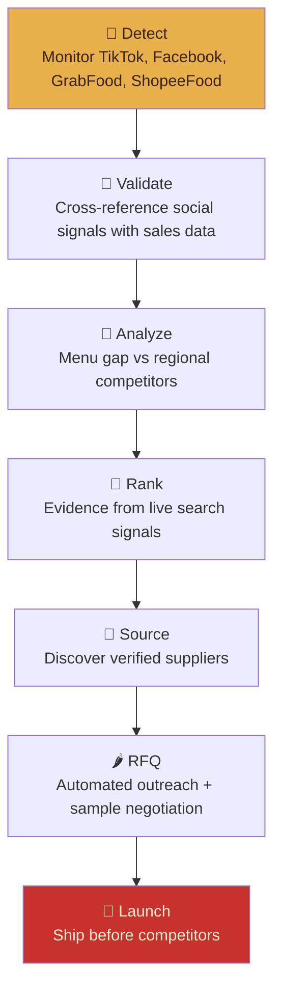
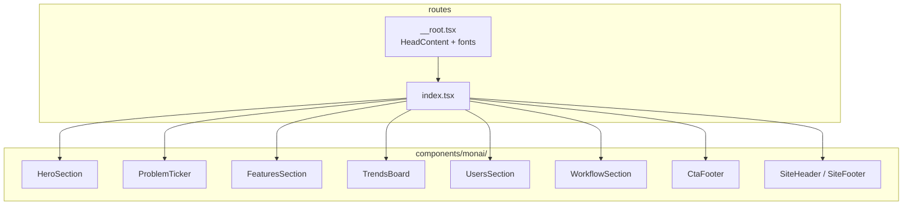
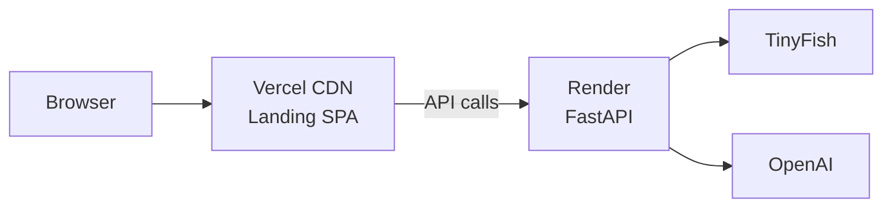

# MónAI

**Vietnam's AI-Powered Food Trend Intelligence**

MónAI helps F&B brands spot viral dishes, forecast adoption, analyze menu gaps, compare regional trends, and discover suppliers — before competitors launch. The repo is a monorepo: a **Vietnamese street-food–inspired marketing landing page** (React) and a **FastAPI backend** wired for TinyFish search + OpenAI analysis.

---

## Table of contents

- [Overview](#overview)
- [Architecture](#architecture)
- [Product workflow](#product-workflow)
- [Tech stack](#tech-stack)
- [Project structure](#project-structure)
- [Getting started](#getting-started)
- [Environment variables](#environment-variables)
- [API reference](#api-reference)
- [Landing page](#landing-page)
- [Design system](#design-system)
- [Deployment](#deployment)
- [Project status](#project-status)

---

## Overview



| Layer | Role | Status |
|-------|------|--------|
| **Frontend** (`frontend/`) | Bánh Mì–themed marketing landing page + shadcn/ui component library for future dashboard | Landing page **live-ready** |
| **Backend** (`main.py`, `app/`) | REST API — TinyFish search/fetch → OpenAI structured analysis | Implemented; needs env vars on deploy |
| **Integrations** | TinyFish (web signals), OpenAI GPT-4o (analysis) | Requires API keys |

---

## Architecture

### System context



### API request flow

Every intelligence endpoint follows the same pipeline: **gather signals → analyze with AI → return structured JSON**.



Forecast path (optional OpenAI prose only — no invented scores):



### Deployment topology



---

## Product workflow

The landing page visualizes MónAI's end-to-end flow as a **bánh mì assembled layer by layer**:



| Step | API support |
|------|-------------|
| Detect | `GET /api/trends/emerging` |
| Validate / Rank | `GET /api/trends/forecast` |
| Analyze | `POST /api/analysis/menu-gap`, `GET /api/trends/regional` |
| Source | `POST /api/suppliers/discover` |
| RFQ | `POST /api/suppliers/outreach` |

---

## Tech stack

### Frontend

| Tool | Purpose |
|------|---------|
| [Vite 8](https://vite.dev/) | Dev server + production build |
| [React 19](https://react.dev/) | UI |
| [TanStack Router](https://tanstack.com/router) | File-based routing |
| [Tailwind CSS v4](https://tailwindcss.com/) | Utility styling + `@theme` tokens |
| [Radix UI](https://www.radix-ui.com/) + [shadcn/ui](https://ui.shadcn.com/) | Accessible component primitives |
| [Lucide React](https://lucide.dev/) | Icons |

**Fonts:** Playfair Display · Bebas Neue · Be Vietnam Pro

### Backend

| Tool | Purpose |
|------|---------|
| [FastAPI](https://fastapi.tiangolo.com/) | Async REST API |
| [Uvicorn](https://www.uvicorn.org/) | ASGI server |
| [tinyfish](https://docs.tinyfish.ai/quick-start) | Official TinyFish Python SDK (Search + Fetch) |
| [OpenAI Python SDK](https://github.com/openai/openai-python) | GPT-4o analysis |
| [Pydantic v2](https://docs.pydantic.dev/) | Request/response models |

**Runtime:** Python 3.12.8 (`runtime.txt`)

---

## Project structure

```
MonAI/
├── main.py                      # FastAPI app entry + CORS
├── requirements.txt
├── runtime.txt
├── render.yaml                  # Render deploy blueprint
├── .env.example                 # Backend env template
│
├── app/
│   ├── routes/
│   │   ├── trends.py            # Emerging, forecast, regional
│   │   ├── analysis.py          # Menu gap analysis
│   │   └── suppliers.py         # Discovery + RFQ outreach
│   └── services/
│       ├── tinyfish_client.py   # Search + fetch wrappers
│       └── ai_client.py         # OpenAI chat completions
│
└── frontend/
    ├── vercel.json              # SPA rewrites
    ├── .env.example             # VITE_API_BASE_URL
    ├── src/
    │   ├── main.tsx
    │   ├── styles.css           # MónAI design tokens (oklch)
    │   ├── routes/
    │   │   ├── __root.tsx       # Fonts, meta, og tags
    │   │   └── index.tsx        # Landing page composition
    │   ├── components/
    │   │   ├── monai/           # Landing sections
    │   │   └── ui/              # shadcn/ui primitives
    │   ├── lib/
    │   │   ├── api.ts           # Backend client (env-driven)
    │   │   └── utils.ts
    │   ├── hooks/
    │   │   └── use-mobile.ts
    │   └── assets/              # Food illustrations + leaf texture
    └── package.json
```

### Frontend component map



---

## Getting started

### Prerequisites

- **Node.js** 20+ and npm
- **Python** 3.12+
- API keys (for backend only): OpenAI, TinyFish

### 1. Clone and install

```bash
git clone <your-repo-url>
cd MonAI
```

**Frontend**

```bash
cd frontend
npm install
cp .env.example .env    # optional for landing-only preview
npm run dev
```

Open [http://localhost:5173](http://localhost:5173).

**Backend**

```bash
cd ..                   # repo root
python -m venv .venv

# Windows
.venv\Scripts\activate
# macOS / Linux
source .venv/bin/activate

pip install -r requirements.txt
cp .env.example .env    # fill in values — see below
uvicorn main:app --reload --port 8000
```

Open [http://localhost:8000/docs](http://localhost:8000/docs) for interactive Swagger UI.

**Required:** Set `TINYFISH_API_KEY` in `.env`. Search and Fetch go through the [official TinyFish Python SDK](https://docs.tinyfish.ai/quick-start). `OPENAI_API_KEY` is optional for richer synthesis.

### 2. Connect frontend to backend (optional)

In `frontend/.env`:

```env
VITE_API_BASE_URL=http://localhost:8000
VITE_DEFAULT_LOCATION=TP.HCM
```

In root `.env`:

```env
ALLOWED_ORIGINS=http://localhost:5173
```

> The landing page and dashboard call the live API via `src/lib/api.ts` (Vite dev proxy or `VITE_API_BASE_URL`).

---

## Environment variables

### Backend (`.env` at repo root)

| Variable | Required | Description |
|----------|----------|-------------|
| `ALLOWED_ORIGINS` | **Yes** | Comma-separated CORS origins (e.g. `http://localhost:5173,https://your-app.vercel.app`). App **will not start** without this. |
| `TINYFISH_API_KEY` | **Yes** | TinyFish API key from [agent.tinyfish.ai/api-keys](https://agent.tinyfish.ai/api-keys) |
| `OPENAI_API_KEY` | No | Optional GPT-4o enrichment; without it, routes structure live TinyFish search/fetch results |
| `TINYFISH_SEARCH_LOCATION` | No | Defaults to `VN` |
| `TINYFISH_SEARCH_LANGUAGE` | No | Defaults to `vi` |
| `PORT` | No | Set automatically on Render |
| `PYTHON_VERSION` | No | Pin Python on Render (also set via `.python-version` → `3.12.8`) |

### Frontend (`frontend/.env`)

| Variable | Required | Description |
|----------|----------|-------------|
| `VITE_API_BASE_URL` | No (landing only) | Backend URL for dashboard / live API calls |
| `VITE_DEFAULT_LOCATION` | For live trend board | Market passed to `/api/trends/emerging` (e.g. `TP.HCM`) |
| `VITE_DEFAULT_CATEGORY` | No | Category for emerging-trends search (default: `food and beverage`) |

---

## API reference

Base URL: `http://localhost:8000` (local) or your Render service URL.

### Trends

| Method | Path | Description |
|--------|------|-------------|
| `GET` | `/api/trends/emerging` | Top emerging trends for a location |
| `GET` | `/api/trends/forecast` | Adoption forecast for a named trend |
| `GET` | `/api/trends/regional` | Compare trends between two regions |

**Example — emerging trends**

```bash
curl "http://localhost:8000/api/trends/emerging?location=TP.HCM&category=beverage"
```

### Analysis

| Method | Path | Description |
|--------|------|-------------|
| `POST` | `/api/analysis/menu-gap` | Menu gap vs trends + optional competitor URLs |

```json
{
  "current_menu_items": ["Cà phê sữa đá", "Bạc xỉu"],
  "location": "Hà Nội",
  "competitor_urls": ["https://example.com/menu"]
}
```

### Suppliers

| Method | Path | Description |
|--------|------|-------------|
| `POST` | `/api/suppliers/discover` | Find wholesalers for trend ingredients |
| `POST` | `/api/suppliers/outreach` | Generate bilingual RFQ email template |

### Health

| Method | Path | Description |
|--------|------|-------------|
| `GET` | `/` | API welcome JSON (Render health check) |
| `GET` | `/docs` | Swagger UI |

---

## Landing page

The home route (`frontend/src/routes/index.tsx`) is a single-page marketing site with seven sections:

| Section | Component | Highlights |
|---------|-----------|------------|
| Hero | `HeroSection` | MónAI wordmark, food collage, steam animation, CTAs |
| Problem | `ProblemTicker` | Scrolling TikTok · GrabFood · ShopeeFood sources |
| Features | `FeaturesSection` | 6-card bento grid themed by Vietnamese dishes |
| Live trends | `TrendsBoard` | Chalkboard-style live trends from API |
| Users | `UsersSection` | Stamped audience cards |
| Workflow | `WorkflowSection` | Bánh mì layer timeline |
| CTA | `CtaFooter` | Banana-leaf bordered “Bắt đầu ngay” block |

Illustrations live in `frontend/src/assets/` (`pho.png`, `banhmi.png`, `capthrung.png`, `banhxeo.png`, `bunbohue.png`, `leaf.jpg`).

---

## Design system

Tokens are defined in `frontend/src/styles.css` using **oklch** and semantic aliases — no hardcoded hex in components.

| Token | Role | Inspiration |
|-------|------|-------------|
| `cream` | Background | Pickled daikon |
| `crust` / `toasted` | Secondary golds | Baguette crust |
| `chili` | Primary / CTAs | Chili red |
| `cilantro` | Accent | Banana leaf green |
| `nuoc` | Text | Nước mắm brown |
| `foam` | Highlights | Cà phê trứng foam |

**Typography:** `--font-display` (Playfair Display) · `--font-punch` (Bebas Neue) · `--font-vn` (Be Vietnam Pro)

**Motifs:** rice-paper texture, banana-leaf dividers, rubber-stamp seals, Vietnamese star bullets, chopstick underlines, steam wisps.

---

## Deployment

### Frontend → Vercel

1. Import the GitHub repo in [Vercel](https://vercel.com).
2. Set **Root Directory** to `frontend`.
3. Framework preset: **Vite** (auto-detect).
4. Build command: `npm run build` · Output: `dist`.
5. Add env var when connecting to backend:
   ```
   VITE_API_BASE_URL=https://<your-render-service>.onrender.com
   ```

`frontend/vercel.json` handles SPA routing:

```json
{ "rewrites": [{ "source": "/(.*)", "destination": "/index.html" }] }
```

### Backend → Render (free tier)

**Option A — Manual (recommended for free):**

1. [Render Dashboard](https://dashboard.render.com) → **New → Web Service** → connect repo.
2. **Do not use Blueprint** if it prompts for paid workspace — create the service manually instead.
3. Settings:
   - **Root directory:** leave empty (repo root)
   - **Runtime:** Python
   - **Instance type:** **Free** (not Starter)
   - **Build command:** `pip install -r requirements.txt`
   - **Start command:** `uvicorn main:app --host 0.0.0.0 --port $PORT`
   - **Health check path:** `/health`
4. Environment variables:

   | Key | Example |
   |-----|---------|
   | `ALLOWED_ORIGINS` | `https://your-app.vercel.app` |
   | `TINYFISH_API_KEY` | your key from [agent.tinyfish.ai/api-keys](https://agent.tinyfish.ai/api-keys) |
   | `OPENAI_API_KEY` | optional |

**Option B — Blueprint (`render.yaml`):**

`render.yaml` includes `plan: free` and `runtime: python`. Without `plan: free`, Render defaults to **Starter ($7/mo)**.

1. **New → Blueprint** → select repo.
2. Confirm the service shows **Free** instance before applying.



### Post-deploy checklist

- [ ] Backend `/` returns JSON on Render
- [ ] Backend `/docs` loads
- [ ] `ALLOWED_ORIGINS` includes exact Vercel URL (no trailing slash)
- [ ] Frontend builds without `VITE_API_BASE_URL` (landing works standalone)
- [ ] CORS preflight succeeds from Vercel origin

---

## Project status

| Area | State |
|------|-------|
| Marketing landing page | ✅ Complete |
| AI Analysis console (`/dashboard` + `#analysis` on home) | ✅ Wired to API |
| Live trend board | ✅ Fetches from live API |
| TinyFish Search + Fetch | ✅ Required (`TINYFISH_API_KEY` only) |
| OpenAI synthesis | Optional enrichment |
| shadcn/ui component library | ✅ Ready for expansion |
| Auth / database | ❌ Out of scope |

### Known considerations

- **Backend deps:** Use a virtualenv with pinned `requirements.txt` (`tinyfish`, `fastapi`, etc.).
- **`.env` syntax:** Ensure no unquoted special characters; dotenv warns on malformed lines.

---

## Scripts reference

| Location | Command | Description |
|----------|---------|-------------|
| `frontend/` | `npm run dev` | Vite dev server |
| `frontend/` | `npm run build` | Typecheck + production build |
| `frontend/` | `npm run preview` | Preview production build |
| repo root | `uvicorn main:app --reload` | Backend dev server |

---

<p align="center">
  <strong>MónAI</strong> — spot the trend, source the supplier, launch first.<br/>
  <em>Built for Vietnam's F&B innovators.</em>
</p>
