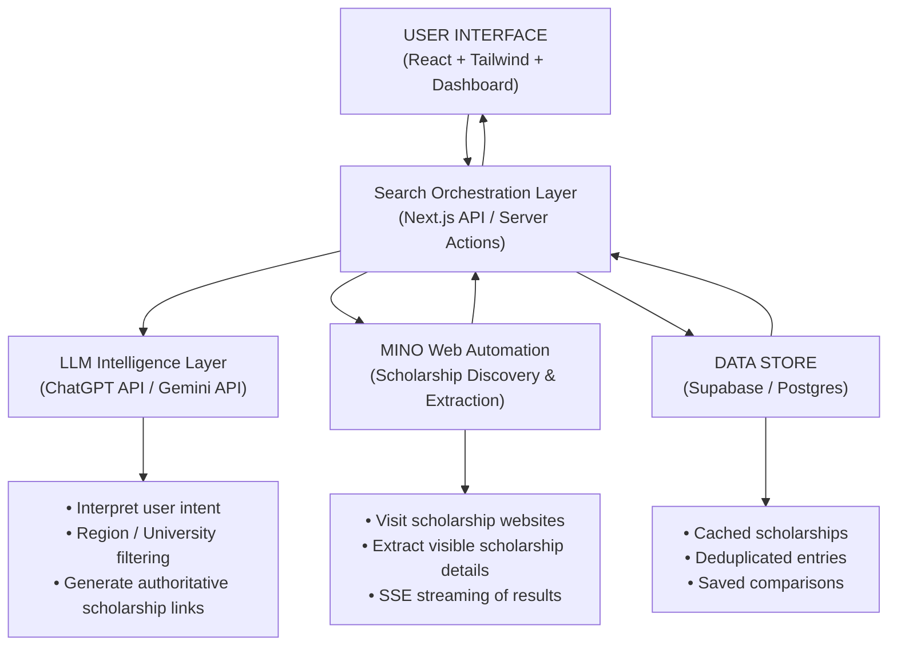

# Project Title - Scholarship Match Engine 

**Live Link:** https://tinyfishscholarshipfinder.lovable.app/

## What This Project Is -
This project is an AI-powered scholarship discovery and comparison system that automatically finds, scans, and extracts scholarship information directly from official scholarship websites worldwide.

Instead of relying on outdated databases, PDFs, or manual searches, the system pulls live, up-to-date data from source websites and returns it in a clean, structured, and comparable format. Users can search scholarships based on financial need, country/region, academic level, or target university.

## How it works 
The system first uses an AI layer to identify and curate relevant scholarship websites based on user input such as:

Country or region

University or institution

Financial need / merit-based criteria

Academic level (undergraduate, postgraduate, PhD)

Field of study

This ensures that only official and relevant sources are used.


## What to Expect
Live, up-to-date data pulled directly from official websites

Parallel web scanning for fast results

Real-time status updates during execution

Structured, comparable output (JSON)

**Demo Video** - https://drive.google.com/file/d/1GXZhJOjiVUP5XcGvTAvRGcYhTWoKXlsE/view?usp=sharing

## Code snippet -
```bash
const response = await fetch("https://mino.ai/v1/automation/run-sse", {
  method: "POST",
  headers: {
    "Content-Type": "application/json",
    "X-API-Key": "sk-mino-YOUR_API_KEY",
  },
  body: JSON.stringify({
    url: "https://www.gebiz.gov.sg",
    goal: "Extract the latest open government tenders. Return JSON with tenderTitle, agency, tenderID, procurementCategory, submissionDeadline, eligibilityCriteria, estimatedValue, tenderStatus, and tenderLink.",
    browser_profile: "lite",
  }),
});

const reader = response.body!.getReader();
const decoder = new TextDecoder();

while (true) {
  const { done, value } = await reader.read();
  if (done) break;

  const chunk = decoder.decode(value);
  for (const line of chunk.split("\n")) {
    if (line.startsWith("data: ")) {
      const data = JSON.parse(line.slice(6));

      // Live browser view
      if (data.streamingUrl) {
        console.log("Live view:", data.streamingUrl);
      }

      // Final structured output
      if (data.type === "COMPLETE" && data.resultJson) {
        console.log("Extracted tenders:", data.resultJson);
      }
    }
  }
}
```
## Tech Stack

Next.js (TypeScript)

Mino API

AI

## Architecture Diagram - 

