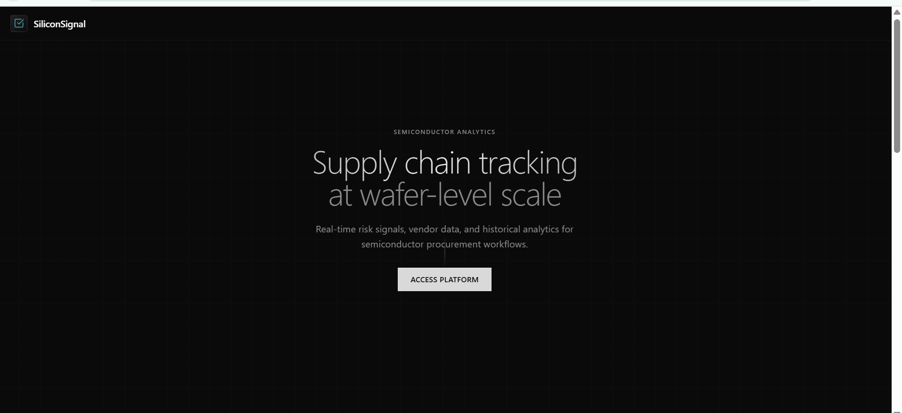
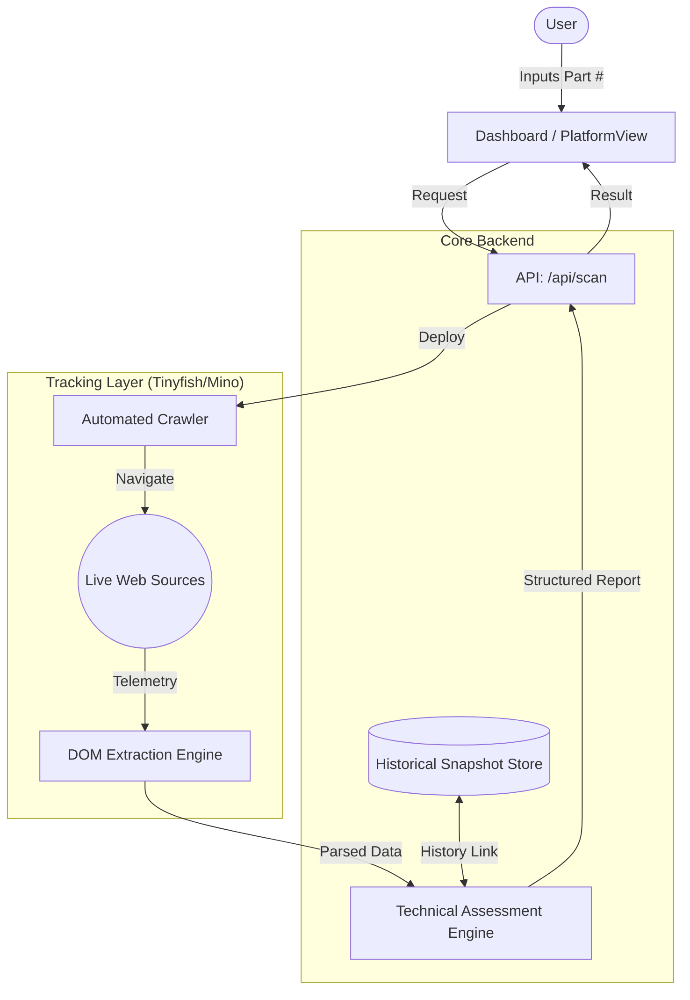

# Silicon Signal

Live link: https://silicon-signal.vercel.app/

## What it is
Silicon Signal is a real-time semiconductor tracking tool that scans distributor and foundry pages to surface lifecycle, availability, lead time, and pricing signals. It uses the TinyFish web agent (Mino) to drive live web navigation and DOM-level extraction.

## Demo video


## TinyFish API usage (snippet)
```ts
if (process.env.MINO_API_KEY) {
  agentLogs.push(`${logPrefix} System Status: Successfully detected MINO_API_KEY. Secure link established.`);
}

const browser = await puppeteer.launch({
  headless: true,
  args: ['--no-sandbox', '--disable-setuid-sandbox', '--disable-dev-shm-usage'],
});
```

## How to run
1. Install deps: `npm install`
2. Create `.env.local`:
```
MINO_API_KEY=your_tinyfish_key
```
3. Start dev server: `npm run dev`

## Architecture diagram

