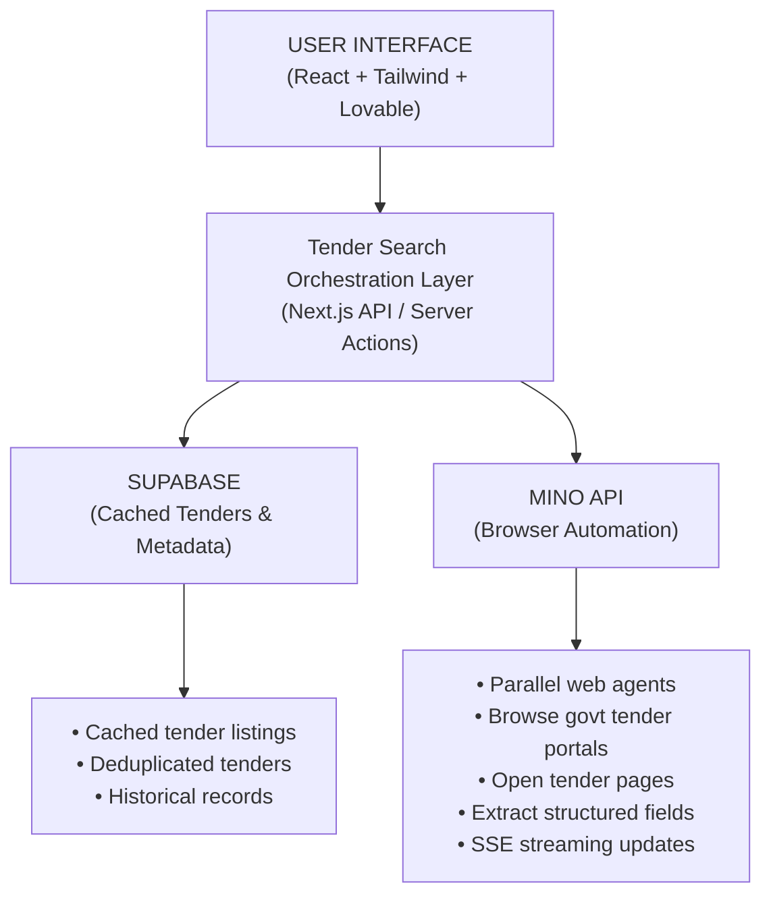

# Project Title - Exam Tutor Finder  

**Live Link**: https://tinyfishtutorsfinder.lovable.app/ 

## What This Project Is -
The Exam Tutor Finder Tool is an AI-powered tutor discovery and comparison platform that helps students find the best competitive exam tutors from across the web in real time.

Instead of manually searching multiple tutoring websites, this system automatically:

1) Uses AI to discover relevant tutor platforms based on user intent

2) Uses the TinyFish Web Agent to browse tutor websites like a real user

3) Extracts live tutor listings directly from source websites

4) Normalizes tutor data into a structured, comparable format

5) Returns a consolidated list of tutors that can be filtered and compared

The goal is to give students a single place to discover, evaluate, and choose tutors for competitive exams based on exam type, budget, teaching mode, and experience. 

## What to Expect

1) Live tutor data extracted directly from real tutoring websites, ensuring up-to-date listings

2) Fast multi-platform search using parallel browser agents

3) Real-time progress updates while tutor websites are being scanned

4) Clean, structured tutor results in standardized JSON format for easy comparison

5) AI-focused matching to show only relevant tutors for selected competitive exams

6) Easy comparison of tutors based on subjects, experience, teaching mode, and pricing

7) Coverage across multiple global tutor marketplaces in one search

8) Scalable system designed to handle multiple websites efficiently

**Demo Video** - https://drive.google.com/file/d/1GOe82HPSTilV_MGob09oexmoiRhEtfbW/view?usp=sharing 

## Code snippet - 
```bash
const response = await fetch("https://mino.ai/v1/automation/run-sse", {
  method: "POST",
  headers: {
    "Content-Type": "application/json",
    "X-API-Key": "sk-mino-YOUR_API_KEY",
  },
  body: JSON.stringify({
    url: "https://www.superprof.com",
    goal: "Extract tutor listings for competitive exams (SAT, ACT, AP, GRE, GMAT, Olympiads). Return JSON with tutorName, examsTaught, subjects, teachingMode, location, price, experience, qualifications, contactLink.",
    browser_profile: "lite",
  }),
});

const reader = response.body!.getReader();
const decoder = new TextDecoder();

while (true) {
  const { done, value } = await reader.read();
  if (done) break;

  const chunk = decoder.decode(value);
  for (const line of chunk.split("\n")) {
    if (line.startsWith("data: ")) {
      const data = JSON.parse(line.slice(6));

      if (data.streamingUrl) {
        console.log("Live view:", data.streamingUrl);
      }

      if (data.type === "COMPLETE" && data.resultJson) {
        console.log("Tutor Results:", data.resultJson);
      }
    }
  }
}
```

## Tech Stack
**Next.js (TypeScript)**

**Mino API**

**AI**

## Architecture Diagram


